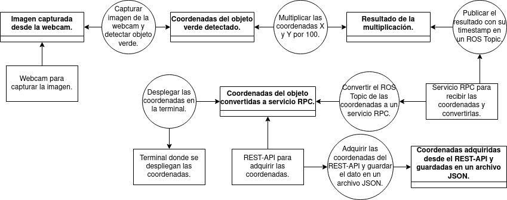
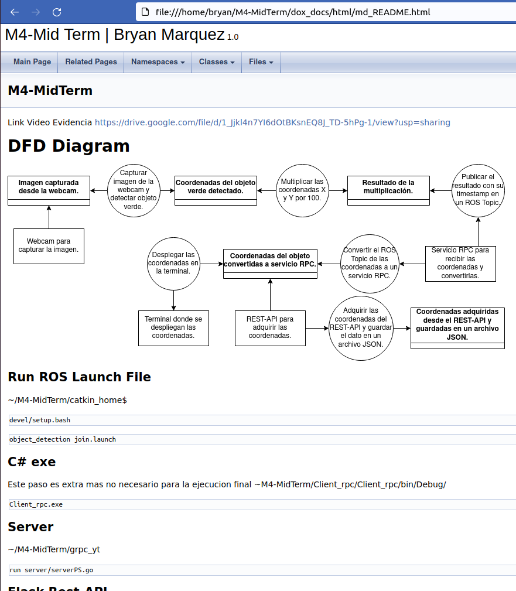
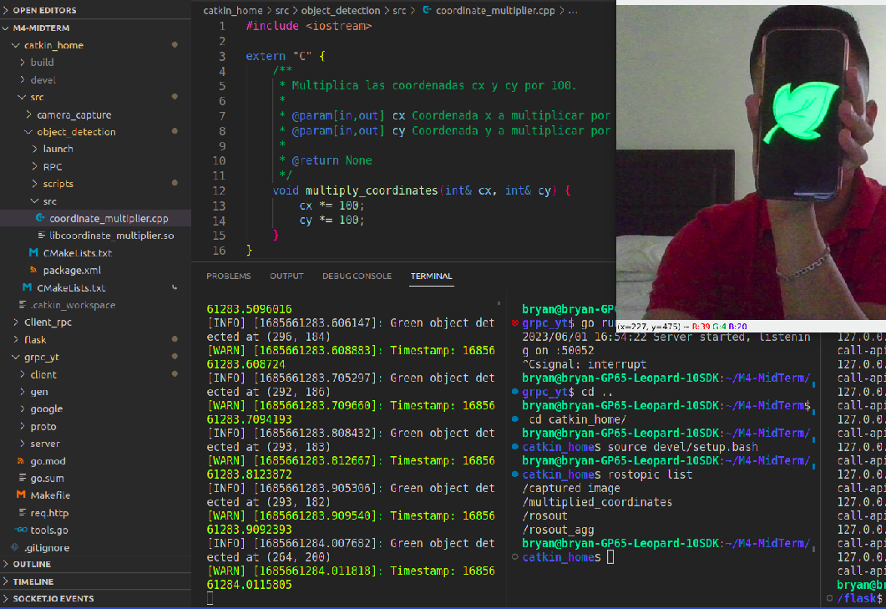
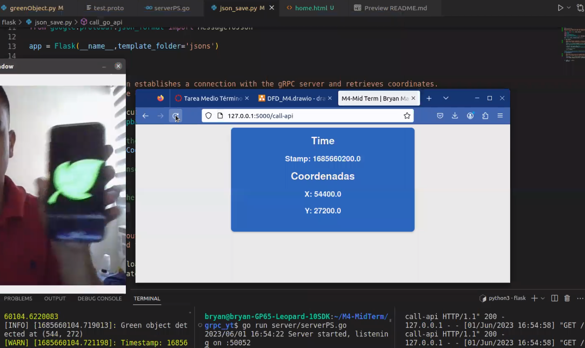

# M4-MidTerm
Link Video Evidencia \
https://drive.google.com/file/d/1_Jjkl4n7YI6dOtBKsnEQ8J_TD-5hPg-1/view?usp=sharing

# DFD Diagram


## Doxygen documentation 
Doxygen Documentation can be found at ~/M4-MidTerm/dox_docs/html
Open any .html file and you will be taken to the doxygen page \
File reccomendation: ```md_README.html```
(You may have to download and open the file to view it) \
My path: ```file:///home/bryan/M4-MidTerm/dox_docs/html/md_README.html``` \
Explore the tabs: namespaces, classes and files. \
Demonstration: \


## Run ROS Launch File
~/M4-MidTerm/catkin_home$ \
```source devel/setup.bash``` \
```roslaunch object_detection join.launch```

## C# exe
Este paso es extra mas no necesario para la ejecucion final \
~M4-MidTerm/Client_rpc/Client_rpc/bin/Debug/ \
```mono Client_rpc.exe```

## Server
~/M4-MidTerm/grpc_yt \
```go run server/serverPS.go```

## Flask Rest-API
~/M4-MidTerm/flask \
```python3 json_save.py```

# Screenshot Evidence
 \


## CORS (Puntos Extra)
CORS (Cross-Origin Resource Sharing) es una política de seguridad implementada por los navegadores web para controlar las solicitudes realizadas por scripts en una página web a recursos ubicados en un dominio diferente al de la página actual, por lo que las solicitudes entre diferentes orígenes están bloqueadas por el navegador. No obstante, CORS proporciona una forma de flexibilizar esta política de seguridad para permitir que los navegadores web realicen solicitudes a recursos en un origen diferente, siempre y cuando el servidor proporcione los encabezados CORS adecuados en las respuestas HTTP. Si el servidor responde con los encabezados CORS adecuados, el navegador permite la solicitud real. En conclusión, CORS afecta a una aplicación web al restringir las solicitudes que se pueden realizar desde un origen diferente al de la página actual. Al configurar CORS correctamente en el servidor, se pueden permitir solicitudes desde orígenes específicos y garantizar una comunicación segura y controlada entre dominios.